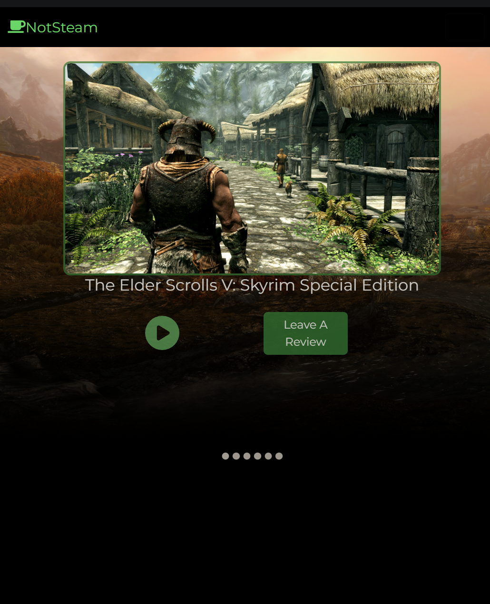
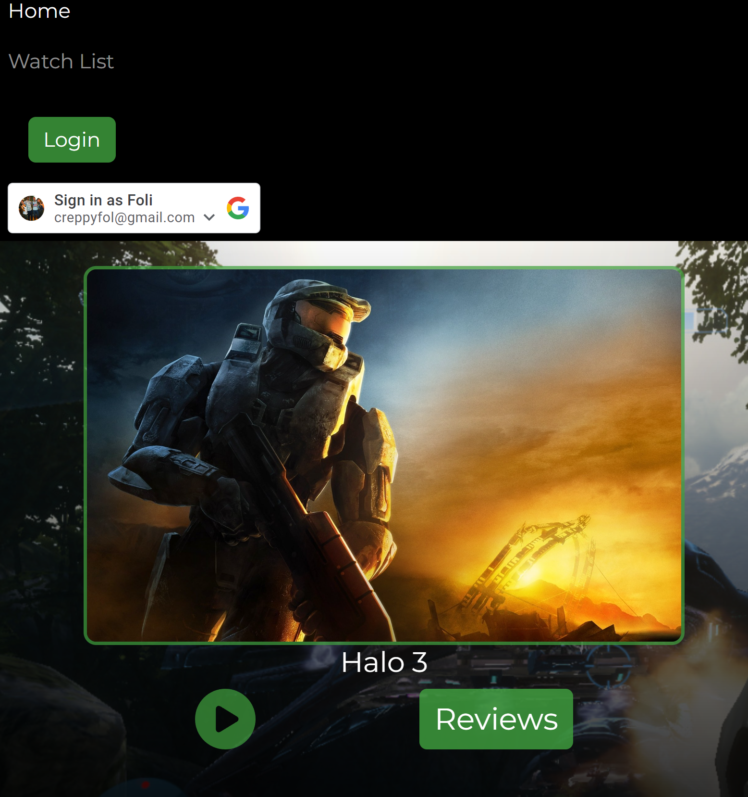
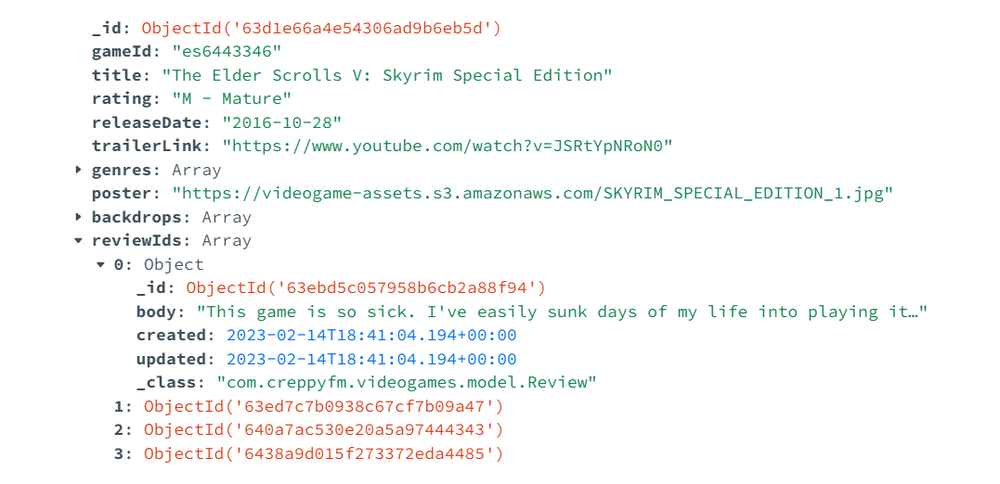

# NotSteam - Backend

## Backend server for NotSteam.games- a video game review web app that allows users to review popular video games.

NotSteam.games is a video game review web app built to allow users to share their opinions on popular video games. 
This RESTful API is built with Java and Spring Boot, and uses Axios HTTP to communicate with the frontend. 

## Authentication

Visitors to the site can log in using Google OAuth one-click login.

## Cloud Services

The API also leverages the following cloud technologies:

* All images are served from an AWS S3 bucket acting as a CDN.
* The API is deployed to an AWS EC2 t2.micro instance, allowing for dynamic scaling of resources.
* Reviews are stored and retrieved from a MongoDB cluster hosted on MongoDB Atlas

## Check it out!

https://notsteam.games/
